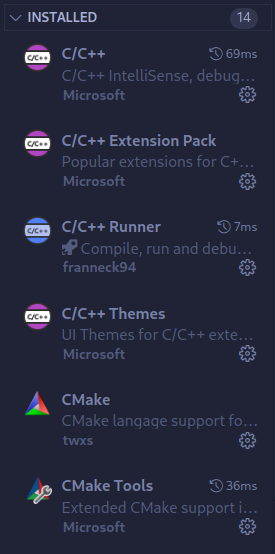
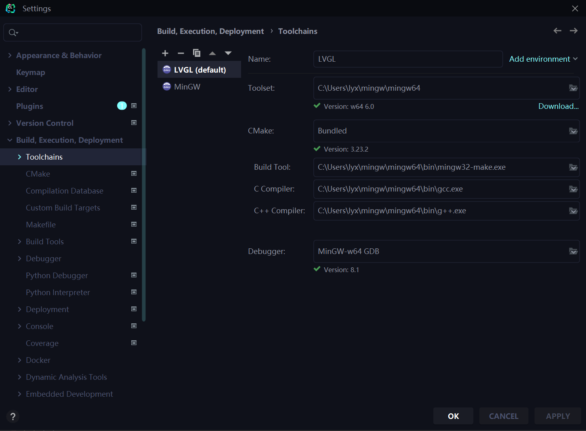
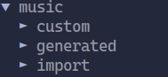
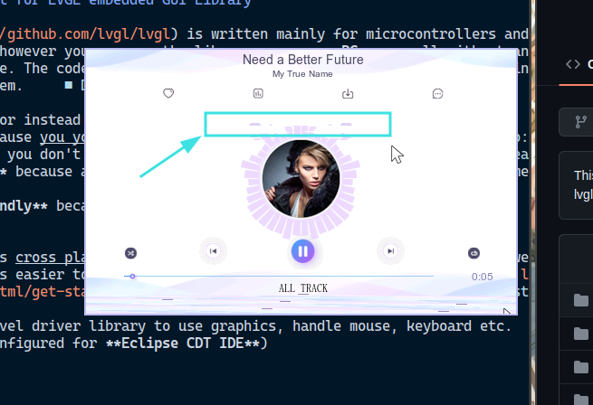
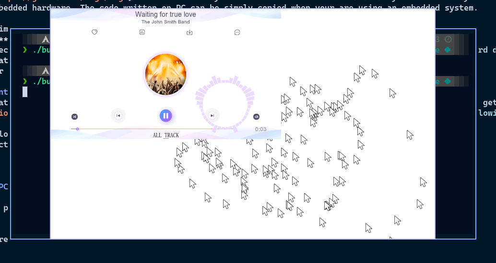

## 实训目标
* 掌握基本的 GUI 编程原理
* 学习、理解并使用 `lvgl` 开源库进行 GUI 设计与实现

## 实训内容
* 实训任务: `lvgl` 是一个活跃的开源 C++ 图形用户界面库，可用于单片机等小型电子设备控制台的 UI 界面设计。最近的一次版本更新中，产生了一个 nightly 版本 v9，但相应的 GUI 设计软件生成的代码还停留在 v8 版本。我们的任务，即是将该生成的代码进行一个 v8 到 v9 的迁移，主要是针对 API 以及部分绘图标识符的更改。
* 具体而言有以下四个步骤
    1. [配置`vscode`调试环境](#配置`vscode`调试环境) 以及 [`clion`配置](#`clion`配置)
    2. [`GUI-Guider`生成使用`v9`代码](#`GUI-Guider`生成使用`v9`代码)
    3. [嵌入`v9`代码并修改相应`API`成功编译](###嵌入`v9`代码并修改相应`API`成功编译)
    4. [上板测试](#后期计划)

## 工作进展
### 配置`vscode`调试环境

1. 下载代码

```bash
git clone xxx
```

2. 手动编译：检查缺失环境，例如`SDL2`之类

```bash
# Makefile 存在
make
# 只有 CMakeLists.txt
mkdir build && cd build
cmake ..
make
```

3. 手动编译通过后，在`vscode`中下载如下插件

<center>
    <br>
    <div style="color:orange; border-bottom: 1px solid #d9d9d9;display: inline-block;color: #999;padding: 2px;">vscode插件</div>
</center>


4. 编辑`.vscode/tasks.json`以及`.vscode/launch.json`等文件加入调试指令

   * `tasks.json`

   ```json
   {
       "version": "2.0.0",
       "tasks": [
           {
               "type": "shell",
               "label": "Build",
               "command": "make",
               "options": {
                   "cwd": "${workspaceFolder}"
               },
               "presentation": {
                   "echo": true,
                   "reveal": "always",
                   "focus": false,
                   "panel": "shared"
               },
               "problemMatcher": {
                   "owner": "cpp",
                   "fileLocation": [
                       "relative",
                       "${workspaceFolder}"
                   ],
                   "pattern": {
                       "regexp": "^(.*):(\\d+):(\\d+):\\s+(warning|error):\\s+(.*)$",
                       "file": 1,
                       "line": 2,
                       "column": 3,
                       "severity": 4,
                       "message": 5
                   }
               },
               "group": "build"
           },
       ]
   }
   ```

    * `launch.json`

    ```json
   {
     "version": "0.2.0",
     "configurations": [
       {
         "name": "g++ build and debug active file",
         "type": "cppdbg",
         "request": "launch",
         // built by `make` command, specified by `Makefile`
         "program": "${workspaceFolder}/build/bin/demo",
         "args": [],
         "stopAtEntry": false,
         "cwd": "${workspaceFolder}",
         "environment": [],
         "externalConsole": false,
         "MIMode": "gdb",
         "setupCommands": [
           {
             "description": "Enable pretty-printing for gdb",
             "text": "-enable-pretty-printing",
             "ignoreFailures": true
           }
         ],
         "preLaunchTask": "Build"
       }
     ]
   }
    ```

### `Clion`配置

`LVGL`官方提供了全平台的模拟器官方搭建方案，由于CLion原生支持Cmake，所以我们使用同样原生支持Cmake的搭建方案：lv_port_pc_eclipse进行模拟器开发环境的搭建。

1. 下载示例库代码与SDL库

   模拟器示例库代码：

   ```shell
   git clone https://github.com/lvgl/lv_port_pc_eclipse
   ```

   SDL库下载：[下载链接](https://github.com/libsdl-org/SDL/releases)

2. 在原有MinGW中配置SDL2

   将SDL2/x86_64_w64-mingw32/include/SDL2复制到MinGW/ x86_64_w64-mingw32/include文件夹中；将SDL2/x86_64_w64-mingw32/lib所有的文件复制到MinGW/ x86_64_w64-mingw32/lib中。

3. 配置Clion工具链

   构建工具、C编译器、C++编译器的路径应该详细对应MinGW中的位置，若不详细制定则会导致最终编译运行失败。

   

4. 其他详细配置

   除先前在Linux系统中对VScode的配置之外，我们还需要在main.c中增加对`SDL.h`的引用

   ```cpp
   #include "SDL.h"
   ```

   

### `GUI-Guider`生成使用`v9`代码
* [ ] TODO

### 嵌入`v9`代码并修改相应`API`成功编译
* 我们需要修改的代码如下：
1. 在 `main.c` 中添加如下代码

```diff
diff --git a/main.c b/main.c
index 1994acd..d07a91a 100644
--- a/main.c
+++ b/main.c
@@ -13,6 +13,9 @@
 #include "lvgl/lvgl.h"
 #include "lvgl/examples/lv_examples.h"
 #include "lvgl/demos/lv_demos.h"
+#include "gui_guider.h"
+#include "events_init.h"
+#include "custom.h"
 
 /*********************
  *      DEFINES
@@ -61,46 +64,51 @@ static lv_disp_t * hal_init(lv_coord_t w, lv_coord_t h);
 
 int main(int argc, char **argv)
 {
-  (void)argc; /*Unused*/
-  (void)argv; /*Unused*/
-
-  /*Initialize LVGL*/
-  lv_init();
-
-  /*Create a default group for keyboard navigation*/
-  lv_group_set_default(lv_group_create());
-
-  /*Initialize the HAL (display, input devices, tick) for LVGL*/
-  hal_init(800, 480);
-
-//  lv_example_switch_1();
-//  lv_example_calendar_1();
-//  lv_example_btnmatrix_2();
-//  lv_example_checkbox_1();
-//  lv_example_colorwheel_1();
-//  lv_example_chart_6();
-//  lv_example_table_2();
-//  lv_example_scroll_2();
-//  lv_example_textarea_1();
-//  lv_example_msgbox_1();
-//  lv_example_dropdown_2();
-//  lv_example_btn_1();
-//  lv_example_scroll_1();
-//  lv_example_tabview_1();
-//  lv_example_tabview_1();
-//  lv_example_flex_3();
-//  lv_example_label_1();
-
-  lv_demo_widgets();
-
-  while(1) {
-      /* Periodically call the lv_task handler.
-       * It could be done in a timer interrupt or an OS task too.*/
-      lv_timer_handler();
-      usleep(5 * 1000);
-  }
-
-  return 0;
+    (void)argc; /*Unused*/
+    (void)argv; /*Unused*/
+
+    /*Initialize LVGL*/
+    lv_init();
+
+    /*Create a default group for keyboard navigation*/
+    lv_group_set_default(lv_group_create());
+
+    /*Initialize the HAL (display, input devices, tick) for LVGL*/
+    hal_init(800, 480);
+
+    //  lv_example_switch_1();
+    //  lv_example_calendar_1();
+    //  lv_example_btnmatrix_2();
+    //  lv_example_checkbox_1();
+    //  lv_example_colorwheel_1();
+    //  lv_example_chart_6();
+    //  lv_example_table_2();
+    //  lv_example_scroll_2();
+    //  lv_example_textarea_1();
+    //  lv_example_msgbox_1();
+    //  lv_example_dropdown_2();
+    //  lv_example_btn_1();
+    //  lv_example_scroll_1();
+    //  lv_example_tabview_1();
+    //  lv_example_tabview_1();
+    //  lv_example_flex_3();
+    //  lv_example_label_1();
+
+    // lv_demo_widgets();
+
+    /*Create a GUI-Guider app */
+    setup_ui(&guider_ui);
+    events_init(&guider_ui);
+    custom_init(&guider_ui);
+
+    while(1) {
+        /* Periodically call the lv_task handler.
+         * It could be done in a timer interrupt or an OS task too.*/
+        lv_timer_handler();
+        usleep(5 * 1000);
+    }
+
+    return 0;
 }
 
 /**********************
@@ -113,24 +121,24 @@ int main(int argc, char **argv)
  */
 static lv_disp_t * hal_init(lv_coord_t w, lv_coord_t h)
 {
-  lv_disp_t * disp = lv_sdl_window_create(w, h);
-  lv_indev_t * mouse = lv_sdl_mouse_create();
-  lv_indev_set_group(mouse, lv_group_get_default());
-  lv_indev_set_disp(mouse, disp);
-
-  LV_IMG_DECLARE(mouse_cursor_icon); /*Declare the image file.*/
-  lv_obj_t * cursor_obj;
-  cursor_obj = lv_img_create(lv_scr_act());         /*Create an image object for the cursor */
-  lv_img_set_src(cursor_obj, &mouse_cursor_icon);   /*Set the image source*/
-  lv_indev_set_cursor(mouse, cursor_obj);           /*Connect the image  object to the driver*/
-
-  lv_indev_t * mousewheel = lv_sdl_mousewheel_create();
-  lv_indev_set_disp(mousewheel, disp);
-  lv_indev_set_group(mousewheel, lv_group_get_default());
-
-  lv_indev_t * keyboard = lv_sdl_keyboard_create();
-  lv_indev_set_disp(keyboard, disp);
-  lv_indev_set_group(keyboard, lv_group_get_default());
-
-  return disp;
+    lv_disp_t * disp = lv_sdl_window_create(w, h);
+    lv_indev_t * mouse = lv_sdl_mouse_create();
+    lv_indev_set_group(mouse, lv_group_get_default());
+    lv_indev_set_disp(mouse, disp);
+
+    LV_IMG_DECLARE(mouse_cursor_icon); /*Declare the image file.*/
+    lv_obj_t * cursor_obj;
+    cursor_obj = lv_img_create(lv_scr_act());         /*Create an image object for the cursor */
+    lv_img_set_src(cursor_obj, &mouse_cursor_icon);   /*Set the image source*/
+    lv_indev_set_cursor(mouse, cursor_obj);           /*Connect the image  object to the driver*/
+
+    lv_indev_t * mousewheel = lv_sdl_mousewheel_create();
+    lv_indev_set_disp(mousewheel, disp);
+    lv_indev_set_group(mousewheel, lv_group_get_default());
+
+    lv_indev_t * keyboard = lv_sdl_keyboard_create();
+    lv_indev_set_disp(keyboard, disp);
+    lv_indev_set_group(keyboard, lv_group_get_default());
+
+    return disp;
 }

diff --git a/main.c b/main.c
index d07a91a..256aa40 100644
--- a/main.c
+++ b/main.c
@@ -16,6 +16,7 @@
 #include "gui_guider.h"
 #include "events_init.h"
 #include "custom.h"
+lv_ui guider_ui;
```

2. `CMakeLists.txt`
```diff
diff --git a/CMakeLists.txt b/CMakeLists.txt
index 306d92f..b40ae4e 100644
--- a/CMakeLists.txt
+++ b/CMakeLists.txt
@@ -3,20 +3,25 @@ project(lvgl)
 set(CMAKE_C_STANDARD 11)#C11
 set(CMAKE_CXX_STANDARD 17)#C17
 set(CMAKE_CXX_STANDARD_REQUIRED ON)
+set(LV_CONF_BUILD_DISABLE_DEMOS TRUE)
+set(LV_CONF_BUILD_DISABLE_EXAMPLES TRUE)
 
 INCLUDE_DIRECTORIES(${PROJECT_SOURCE_DIR})
-INCLUDE_DIRECTORIES(custom)
-INCLUDE_DIRECTORIES(generated)
-INCLUDE_DIRECTORIES(import)
-INCLUDE_DIRECTORIES(generated/guider_fonts)
+
+INCLUDE_DIRECTORIES(music/custom)
+INCLUDE_DIRECTORIES(music/generated)
+INCLUDE_DIRECTORIES(music/import)
+INCLUDE_DIRECTORIES(music/generated/guider_fonts)
 INCLUDE_DIRECTORIES(lvgl/src)
+# INCLUDE_DIRECTORIES(music)
 
 file(GLOB_RECURSE INCLUDES "./*.h" )
-file(GLOB_RECURSE CUSTOMS "./*.c")
+
+file(GLOB_RECURSE CUSTOMS "./music/*.c")
 
 add_subdirectory(lvgl)
 
-SET(EXECUTABLE_OUTPUT_PATH ${PROJECT_SOURCE_DIR}/build/bin) 
+SET(EXECUTABLE_OUTPUT_PATH ${PROJECT_SOURCE_DIR}) 
 SET(CMAKE_CXX_FLAGS "-O3")
 
 find_package(SDL2 REQUIRED SDL2)
@@ -25,5 +30,7 @@ include_directories(${SDL2_INCLUDE_DIRS})
 add_executable(main main.c mouse_cursor_icon.c ${SOURCES} ${CUSTOMS} ${INCLUDES})
 
 add_compile_definitions(LV_CONF_INCLUDE_SIMPLE)
-target_link_libraries(main PRIVATE lvgl lvgl::examples lvgl::demos ${SDL2_LIBRARIES})
+
+target_link_libraries(main PRIVATE lvgl ${SDL2_LIBRARIES} )
+
 add_custom_target (run COMMAND ${EXECUTABLE_OUTPUT_PATH}/main)

```

* 将生成的文件放置与如此的结构
    * 


## 遇到的问题和解决方案

* [ ] GIF refreshes too slow or wrongly when interfered by mouse.
    * 
* [x] Window Size Error. Actual Window Size exceeds valid zone.
    * 
    * 解决方案如下：
    ```diff
    diff --git a/main.c b/main.c
    index de940cf..96b1a2c 100644
    --- a/main.c
    +++ b/main.c
    @@ -77,7 +77,8 @@ int main(int argc, char **argv)
         lv_group_set_default(lv_group_create());
     
         /*Initialize the HAL (display, input devices, tick) for LVGL*/
    -    hal_init(800, 480);
    +    // 480x272 Resolution
    +    hal_init(480, 272);
     
         //  lv_example_switch_1();
         //  lv_example_calendar_1();
    
    ```

## 后期工作计划

* [ ] 完成上板测试并修复 bug
* [ ] 整理版本迁移文档
* [ ] （有时间的话）自由发挥设计 UI
