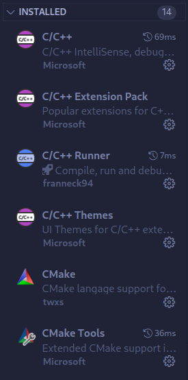
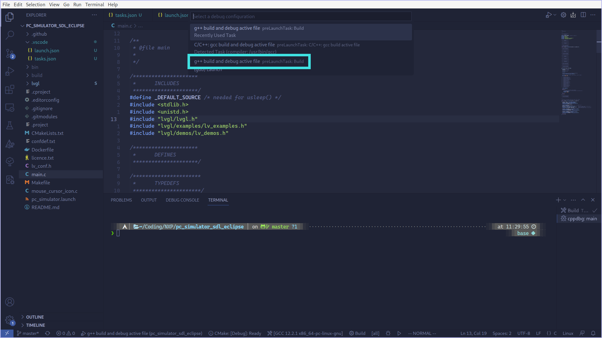

# NXP 实习 第七组 DOC

1. [配置`vscode`调试环境](#配置`vscode`调试环境)
2. [`clion`配置](#`clion`配置)
3. [`GUI-Guider`生成使用`v9`代码](`GUI-Guider`生成使用`v9`代码)
4. [嵌入`v9`代码并修改相应`API`成功编译](嵌入`v9`代码并修改相应`API`成功编译)

## 配置`vscode`调试环境
1. 下载代码
```bash
git clone --recursive https://github.com/littlevgl/pc_simulator_sdl_eclipse.git
```
2. 手动编译：检查缺失环境，例如`SDL2`之类
```bash
# Makefile 存在, 但官方建议使用 cmake 工具链
make
# cmake
mkdir build && cd build
cmake ..
make 
# make -j<num> 可以开启多线程编译，其中`<num>`线程数量
# 例如：make -j8
```

3. 手动编译通过后，在`vscode`中下载如下插件
    * 
4. 编辑`.vscode/tasks.json`以及`.vscode/launch.json`文件加入调试配置
    * `tasks.json`
    ```json
   {
       "version": "2.0.0",
       "tasks": [
           {
               "type": "shell",
               "label": "Build",
               "command": "cmake .. && make",
               "options": {
                   "cwd": "${workspaceFolder}/build"
               },
               "presentation": {
                   "echo": true,
                   "reveal": "always",
                   "focus": false,
                   "panel": "shared"
               },
               "problemMatcher": {
                   "owner": "cpp",
                   "fileLocation": [
                       "relative",
                       "${workspaceFolder}"
                   ],
                   "pattern": {
                       "regexp": "^(.*):(\\d+):(\\d+):\\s+(warning|error):\\s+(.*)$",
                       "file": 1,
                       "line": 2,
                       "column": 3,
                       "severity": 4,
                       "message": 5
                   }
               },
               "group": "build"
           },
       ]
   }
    ```
    * `launch.json`
    ```json
    {
      "version": "0.2.0",
      "configurations": [
        {
          "name": "g++ build and debug active file",
          "type": "cppdbg",
          "request": "launch",
          // built by `make` command, specified by `Makefile`
          "program": "${workspaceFolder}/bin/main",
          "args": [],
          "stopAtEntry": false,
          "cwd": "${workspaceFolder}",
          "environment": [],
          "externalConsole": false,
          "MIMode": "gdb",
          "setupCommands": [
            {
              "description": "Enable pretty-printing for gdb",
              "text": "-enable-pretty-printing",
              "ignoreFailures": true
            }
          ],
          "preLaunchTask": "Build"
        }
      ]
    }
    ```
    > 大致意思就是`launch.json`告诉`vscode`你要进行`Debug`之前需要跑一下`Build`这个任务，然后在`tasks.json`里定义`Build`任务为在`build`文件夹下进行`cmake .. && make`编译

5. 进行编译、调试
    1. 在`CMakeLists.txt`文件中设置`set(CMAKE_BUILD_TYPE Debug)`
    2. 选择`preLaunchTask`为`Build`的选项
    
    3. 接下来在`vscode`中打断点就能生效了


## `clion`配置
## `GUI-Guider`生成使用`v9`代码
## 嵌入`v9`代码并修改相应`API`成功编译


